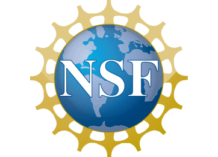

IFDS is an NSF Tripods Institute at the University of Washington funded by the [NSF grant CCF 2023166](https://www.nsf.gov/awardsearch/showAward?AWD_ID=2023166). It also sits under the umbrella of the broader [eScience Institute](http://escience.washington.edu/) which serves as a portal to data science initiatives at UW. IFDS focuses on developing theoretical and algorithmic tools bridging mathematics, computer science, and statistics for addressing contemporary data science challenges. IFDS contributes to the broader effort of the eScience Institute, which focuses on connecting data science methodology with domain scientists.

### Mission Statement:
Data science is making an enormous impact on science and society, but its success is uncovering pressing new challenges that stand in the way of further progress. Outcomes and decisions arising from many machine learning processes are not robust to errors and corruption in the data; data science algorithms are yielding biased and unfair outcomes, as concerns about data privacy continue to mount; and machine learning systems suited to dynamic, interactive environments are less well developed than corresponding tools for static problems. Only by an appeal to the foundations of data science can we understand and address challenges such as these. Building on the work of three TRIPODS Phase I institutes, the new Institute for Foundations of Data Science (IFDS) brings together researchers from the Universities of Washington, Wisconsin-Madison, California-Santa Cruz, and Chicago, organized around the goal of tackling these critical issues. Members of IFDS have complementary strengths in the TRIPODS disciplines of mathematics, statistics, and theoretical computer science, and a proven record of collaborating to push theoretical boundaries by synthesizing knowledge and experience from diverse areas. Students and postdoctoral members of IFDS will be trained to be fluent in the languages of several disciplines, and able to bridge these communities and perform transdisciplinary research in the foundations of data science. In concert with its research agenda, IFDS will engage the data science community through workshops, summer schools, and hackathons. Its diverse leadership, committed to equity and inclusion, proposes extensive plans for outreach to traditionally underrepresented groups. Governance, management, and evaluation of the institute will build on the successful and efficient models developed during Phase I.

To address critical issues at the cutting edge of data science research, IFDS will organize its research around four core themes. The complexity theme will synthesize various notions of complexity from multiple disciplines to make breakthroughs in the analysis of optimization and sampling methods, develop tools for assessing the complexity of data models, and seek new methods with better complexity properties, to make complexity a more powerful tool for understanding and inventing algorithms in data science. The robustness theme considers data that contains errors or outliers, possibly due to an adversary, and will design methods for data analysis and prediction that are robust in the face of these errors. The theme on closed-loop data science tackles the issues of acquiring data in ways that reveal the information content of the data efficiently, using strategic and sequential policies that leverage information gathered already from past data. The theme on ethics and algorithms addresses issues of fairness and bias in machine learning, data privacy, and causality and interpretability. The four themes intersect in many ways, and most IFDS researchers will work in two or more of them. By making concerted progress on these fundamental fronts, IFDS will lower several of the barriers to better understanding of data science methodology and to its improved effectiveness and wider relevance to application areas. Additionally, IFDS will organize and host activities that engage the data science community at all levels of seniority. Annual workshops will focus on the critical issues identified above and others that are sure to arise over the next five years. Comprehensive plans for outreach and education will draw on previous experience of the Phase I institutes and leverage institutional resources at the four sites. Collaborations with domain science researchers in academia, national laboratories, and industry, so important in illuminating issues in the fundamentals of data science, will continue through the many channels available to IFDS members, including those established in the TRIPODS+X program. Relationships with other institutes at each IFDS site will further extend the impact of IFDS on domain sciences and applications.

### Principal Investigators:
* [Dmitriy Drusvyatskiy](http://sites.math.washington.edu/~ddrusv/)
* [Maryam Fazel](https://faculty.washington.edu/mfazel/)
* [Zaid Harchaoui](http://faculty.washington.edu/zaid/)
* [Kevin Jamieson](https://homes.cs.washington.edu/~jamieson/)
* [Yin Tat Lee](http://yintat.com/)
* [Abel Rodriguez](https://stat.uw.edu/about-us/people/abel-rodriguez)

### About the Institute:
IFDS was founded through a major grant from the NSF TRIPODS (Transdisciplinary Research in Principles of Data Science) program. TRIPODS implements the NSF's vision of *Harnessing the Data Revolution,* one of its ["10 Big Ideas"](https://www.nsf.gov/about/congress/reports/nsf_big_ideas.pdf) for future investment. Beyond its role as a platform for the research detailed in the UW team's [grant proposal](https://www.nsf.gov/awardsearch/showAward?AWD_ID=1740551), IFDS helps train graduate students and postdoctoral scholars and organize workshops and hackathons.

**Partner Tripods institute**: University of Wisconsin’s Institute for Foundations of Data Science [(IFDS)](https://ifds.wisc.edu/)

